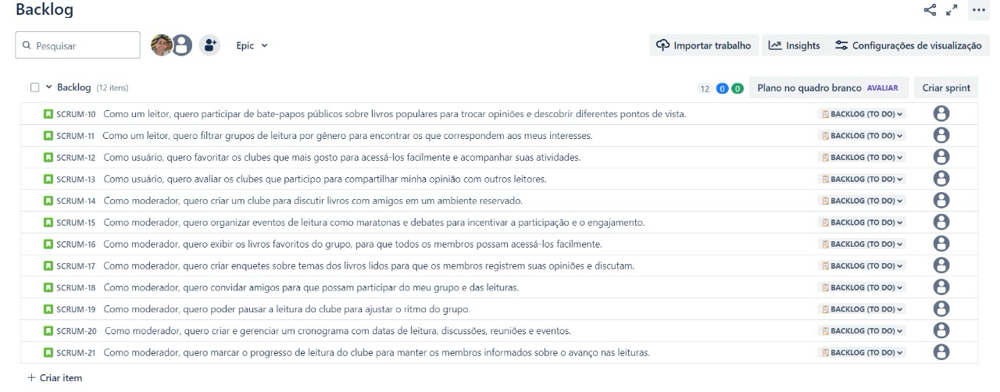
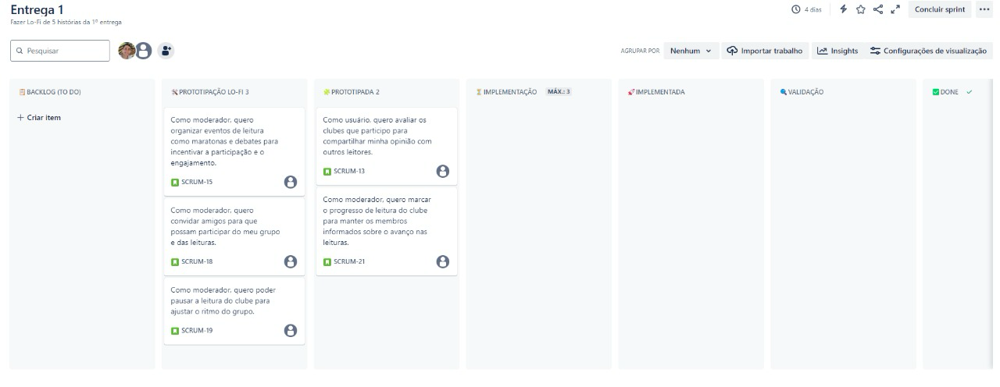

# 📖 BookHeaded

Bem-vindo ao repositório do nosso projeto Bookheaded. Nossa plataforma está sendo desenvolvida como parte da disciplina de Fundamentos de Software (FDS) para criar uma comunidade interativa entre os leitores, permitindo que eles compartilhem e discutam suas leituras de forma mais envolvente. Este novo projeto, chamado **Bookheaded**, visa principalmente aprimorar e promover conexões significativas através do amor pela leitura.
 

## 🖇️ Links Importantes

  <li>
    <a href="https://projectdjango.atlassian.net/jira/software/projects/KAN/boards/1">Link do Jira</a>
  </li>

## ✅ Entregas

KickOff

<ul>
  <li>
<a href="https://www.canva.com/design/DAGOz7ny6Lk/_ZUQBKPhQTSez4pVsoDh3g/edit?utm_content=DAGOz7ny6Lk&utm_campaign=designshare&utm_medium=link2&utm_source=sharebutton">Slide do Kickoff</a>
</li>
</ul>

## 👩‍💻 Membros

<ul>
  <li>
    <a href="https://github.com/amanda-montarroios">Amanda Montarroios</a> - amo@cesar.school 📩
  </li>
  <li>
    <a href="https://github.com/JhMicucci">João Micucci</a> - jhmm@cesar.school 📩
  </li>
   <li>
    <a href="https://github.com/maludantass">Malu Dantas</a> - mldt@cesar.school 📩
  </li>
  <li>
    <a href="https://github.com/Mateus-Ribeir0">Matheus Ribeiro</a> -mar2@cesar.school 📩
  </li>
  <li>
    <a href="https://github.com/jpmamededs">João Pedro Mamede</a> - jpmd2@cesar.school 📩
  </li>
  <li>
    <a href="https://github.com/Carlosesposito22">Carlos Eduardo Espósito</a> - ceec@cesar.school 📩
  </li>
</ul>

Entrega 1

 

## 📑 Jira Backlog
   

 

## 📑 Jira Board 
  

 

## 📑 Prototipação Lo-Fi

  <a href="https://www.figma.com/design/647wQMhbLuuVg614lNbp5g/Untitled?node-id=0-1&t=NoCqAA1pU0jS4wmj-1" style="text-decoration: none;">
  🧷 Figma
  </a>

 

## 📹 Screencast do Protótipo

  <a href="https://www.youtube.com/watch?v=toAvguviqcI" style="text-decoration: none;">
  🧷 Screencast do protótipo Lo-Fi (1)
</a>

 

